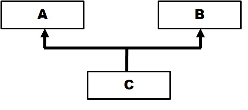
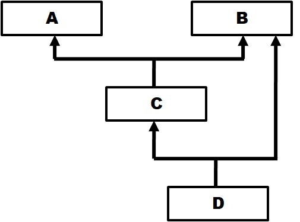
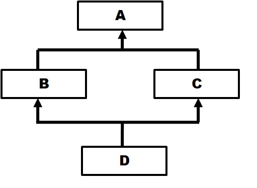
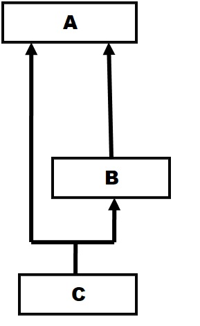

# Item	25	Initialize	Parent	Classes	with	super

* diamond inheritance

python 3's MRO(Method Resolution Order) uses C3 Linearization Algorithm, it's basically depth-first-search, but with 3 extra rules:

(1): every class should only be visited once

(2): any parent classes should be visted after its child classes

(3): classes order should remain in mro

1. case1



```
def print_mro(mro):
    mro = [c.__name__ for c in mro]
    mro = '-->'.join(mro)
    print('visited order:', mro)

# case 1

class A:
    def process(self):
        print('A processing')

class B:
    def process(self):
        print('B processing')

class C(A, B):
    pass

c = C()
c.process()
print_mro(C.mro())

>>>A processing
>>>visited order: C-->A-->B-->object
```

according to rule(3), A should before B, rule (2): C should before A and B, perform dfs, we got C-->A-->B-->object


2. case 2



```
# case 2
class A:
    def process(self):
        print('process A')

class B:
    def process(self):
        print('process B')
# B will before A
class C(B, A):
    pass


# C will before B
class D(C, B):
    pass

d = D()
d.process()
print_mro(D.mro())

>>>process B
>>>visited order: D-->C-->B-->A-->object
```

according to rule(3): C should before B, B should before A, according to rule (2), D should before C and B, C should before B and A.

3. case 3



```

class A:
    def process(self):
        print('processing A')

class B(A):
    pass

class C(A):
    def process(self):
        print('prcessing C')

class D(B, C):
    pass

d = D()
d.process()
print_mro(D.mro())

>>>prcessing C
>>>visited order: D-->B-->C-->A-->object
```
according to rule (3): B should before C, according to rule(2): D should before B and C, B should before A and C should before A.

4. case 4



```
class A:
    def process(self):
        print('processing A')

class B(A):
    def process(self):
        print('processing B')

class C(A, B):
    pass

c = C()
c.process()
print_mro(c.mro()


Traceback (most recent call last):
  File "Item25_Initialize_Parent_Classes_with_super/super.py", line 132, in <module>
    class C(A, B):
TypeError: Cannot create a consistent method resolution
order (MRO) for bases B, A
```

according to rule(3): A should before B, according to rule(2): B should before A(B is the subclass of A), therefore there will be an error constructing class C


* Always	use	the	super	built-in	function	to	initialize	parent	classes.

No:
```
class Base:
    def __init__(self, value):
        print('base')
        self.value = value

class TimesFive(Base):
    def __init__(self, value):
        print('times five')
        Base.__init__(self, value)
        self.value *= 5

class PlusTwo(Base):
    def __init__(self, value):
        print('plus two')
        Base.__init__(self, value)
        self.value += 2

class ThisWay(TimesFive, PlusTwo):
    def __init__(self, value):
        print('this way')
        TimesFive.__init__(self, value)
        PlusTwo.__init__(self, value

print(';;;;;;;;;;;;;;;')
foo = ThisWay(5)
print('5 * (5 + 2): ', foo.value)
print(';;;;;;;;;;;;;;;')
from pprint import pprint
pprint(ThisWay.mro())


>>>;;;;;;;;;;;;;;;
>>>this way
>>>times five
>>>base
>>>plus two
>>>base
>>>5 * (5 + 2):  7
>>>;;;;;;;;;;;;;;;
>>>[<class '__main__.ThisWay'>,
>>> <class '__main__.TimesFive'>,
>>> <class '__main__.PlusTwo'>,
>>> <class '__main__.Base'>,
>>> <class 'object'>]
```

use __init__() method to initialize class instance, would cause Base class to initialize twice.


Yes:
```

class Base:
    def __init__(self, value):
        print('base')
        self.value = value

# Diamond inheritance
class TimesFive(Base):
    def __init__(self, value):
        print('times five')
        #Base.__init__(self, value)
        super().__init__(value)
        self.value *= 5


class PlusTwo(Base):
    def __init__(self, value):
        print('plus two')
        #Base.__init__(self, value)
        super().__init__(value)
        self.value += 2

class ThisWay(TimesFive, PlusTwo):
    def __init__(self, value):
        print('this way')
        super().__init__(value)

print(';;;;;;;;;;;;;;;')
foo = ThisWay(5)
print('5 * (5 + 2): ', foo.value)
print(';;;;;;;;;;;;;;;')
from pprint import pprint
pprint(ThisWay.mro())


>>>;;;;;;;;;;;;;;;
>>>this way
>>>times five
>>>plus two
>>>base
>>>5 * (5 + 2):  35
>>>;;;;;;;;;;;;;;;
>>>[<class '__main__.ThisWay'>,
>>> <class '__main__.TimesFive'>,
>>> <class '__main__.PlusTwo'>,
>>> <class '__main__.Base'>,
>>> <class 'object'>]
```

class invoke order is opposite of ThisWay.mro() order.